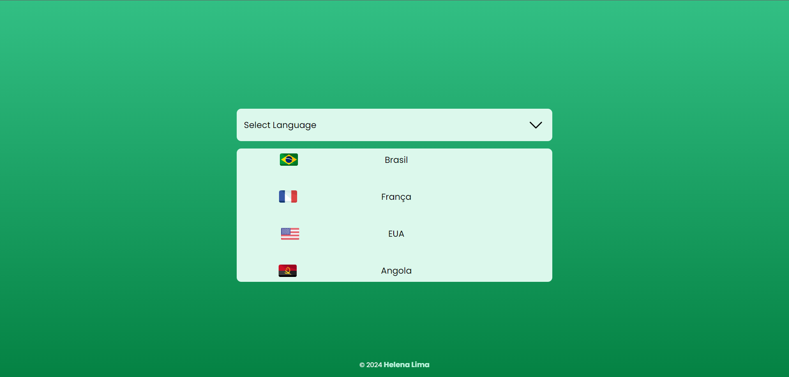

# dropdownPaises
<h1 align="center">Países - Dropdown</h1>

 Site feito para estudo do SASS como pré-processador do CSS. 

  <a href="#-tecnologias">Tecnologias</a>&nbsp;&nbsp;&nbsp;|&nbsp;&nbsp;&nbsp;
  <a href="#-projeto">Projeto</a>&nbsp;&nbsp;&nbsp;|&nbsp;&nbsp;&nbsp;
  <a href="#memo-licença">Licença</a>

  

 

 
    

## 🚀 Tecnologias

-Nesse projeto foi utilizado as seguintes tecnologias:

-SASS  
-HTML  
-JS  
-Github  

## 💻 Projeto

 Site feito para estudo do SASS como pré-processador do CSS, além disso foi feito uma aplicação do dropDown funcional com o uso do JavaScript para executar algumas ações básicas com os elementos.

- [Visite o projeto online](https://helenapl145.github.io/dropdownPaises/)

Esse projeto está sob a licença MIT.

---

Feito com ♥ by Helena Lima

